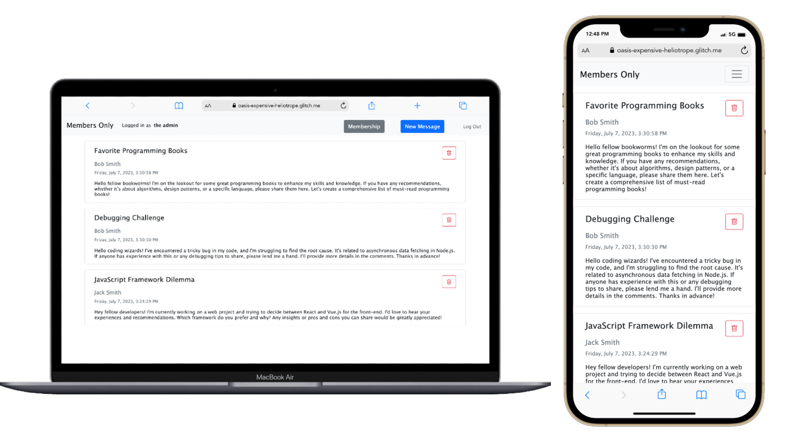

# TOP Project: Members Only

Main points about the implemented functionalities:

- Anyone can see the messages, but only members can see their authors and timestamps.
- Only members can post new messages.
- Only the admin can delete messages.

## See all the features

To see all the features you need to create an account and become a member, and/or log in as admin:

- Secret code to become a member: `VerySecretCode`
- Login for the admin account: `admin@membersonly.com`
- Password for the admin account: `VerySecretPassword`

## Preview

## Screenshots

## Live preview

- [See the live preview here](https://oasis-expensive-heliotrope.glitch.me/)

## Project assignment

- [See the project assignment here](https://www.theodinproject.com/lessons/nodejs-members-only)
